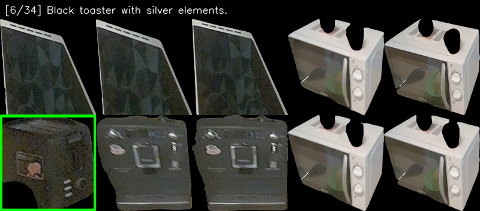
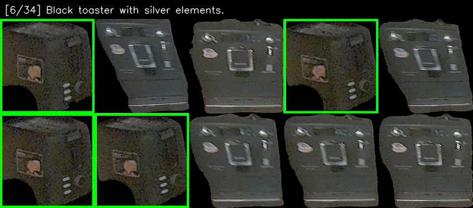
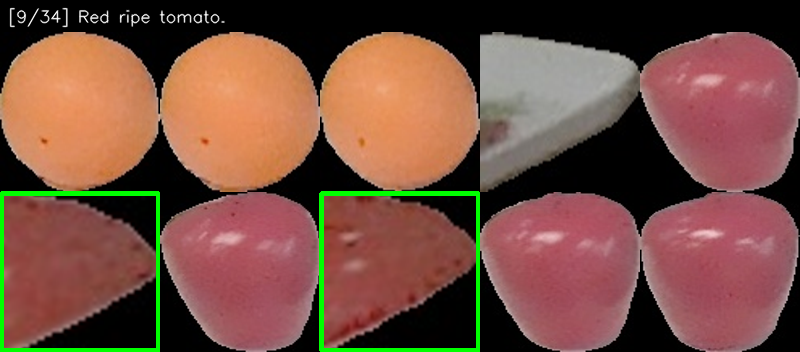
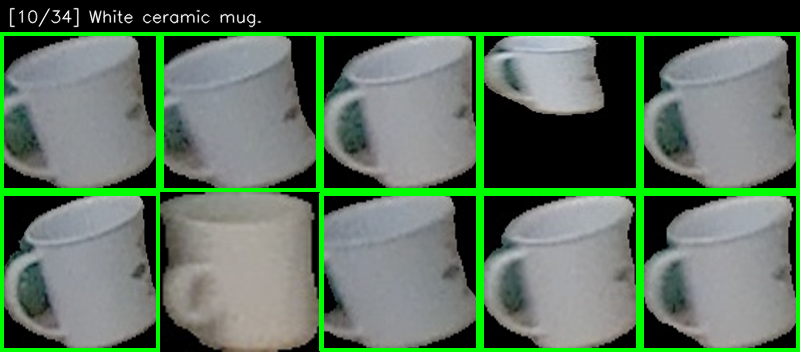
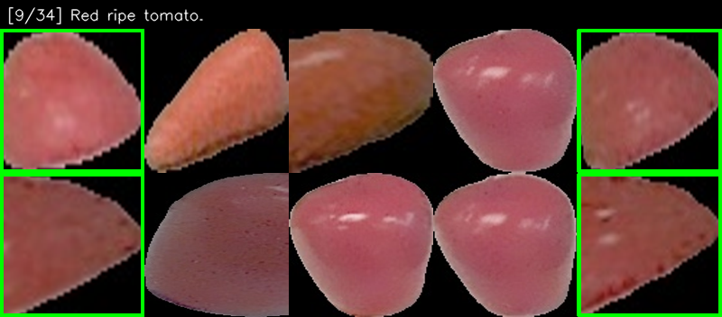
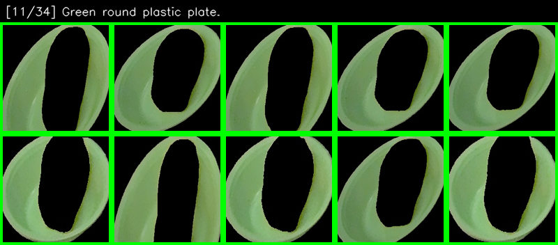
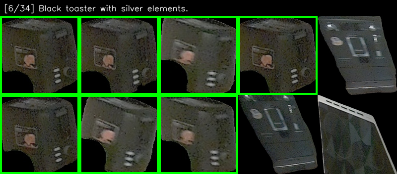
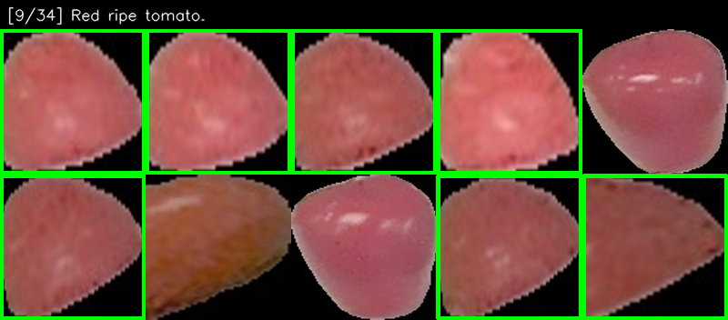

# [CLIP COCO 5K Kharpaty Split dataset]

## Baseline captions

### Baseline CLIP (ViT-L-14, OpenAI pretrain)
```
COCO 5K T2I recalls:
R@1: 0.36   Map@R: 0.32
R@5: 0.61   R-P: 0.42
R@10: 0.71  ECCV R@1: 0.73

Avg query time: 0.0002s
```
### CLIP (ViT-L-14, OpenAI pretrain) -> ALBEF (base)
```
R@1: 0.52   Map@R: 0.41
R@5: 0.76   R-P: 0.50
R@10: 0.84  ECCV R@1: 0.87
```

### CLIP (ViT-L-14, OpenAI pretrain) -> BLIP2 ITM (pretrain)
```
R@1: 0.63   Map@R: 0.42
R@5: 0.83   R-P: 0.49
R@10: 0.87  ECCV R@1: 0.92
```

### CLIP (ViT-L-14, OpenAI pretrain) -> Qwen3-VL-Embedding (Qwen3-VL-Reranker-2B)
```
R@1: 0.60   Map@R: 0.41
R@5: 0.81   R-P: 0.49
R@10: 0.86  ECCV R@1: 0.89
```

# [robotics_kitchen_dataset_v3]

## Baseline captions

### Baseline CLIP (ViT-L-14, OpenAI pretrain)
```
R@1: 0.02  P@1: 0.59  nDCG@1: 0.59
R@5: 0.08  P@5: 0.51  nDCG@5: 0.53
R@50: 0.50  P@50: 0.37  nDCG@50: 0.50
MAP@50: 0.38

Avg query time: 0.0002s
```




### CLIP (ViT-L-14, OpenAI pretrain) -> ALBEF (base)
```
R@1: 0.02  P@1: 0.53  nDCG@1: 0.53
R@5: 0.08  P@5: 0.54  nDCG@5: 0.54
R@50: 0.50  P@50: 0.37  nDCG@50: 0.50
MAP@50: 0.39

Avg query time: 0.0901s
```




### CLIP (ViT-L-14, OpenAI pretrain) -> BLIP2 ITM (pretrain)
```
R@1: 0.02  P@1: 0.71  nDCG@1: 0.71
R@5: 0.09  P@5: 0.60  nDCG@5: 0.62
R@50: 0.50  P@50: 0.37  nDCG@50: 0.53
MAP@50: 0.42

Avg query time: 0.9285s
```





### CLIP (ViT-L-14, OpenAI pretrain) -> Qwen3-VL-Embedding (Qwen3-VL-Reranker-2B)
```
R@1: 0.02  P@1: 0.74  nDCG@1: 0.74
R@5: 0.10  P@5: 0.63  nDCG@5: 0.65
R@50: 0.50  P@50: 0.37  nDCG@50: 0.54
MAP@50: 0.42

Avg query time: 2.0804s
```





## LLM (gemma3:4b) enriched captions (N=4, T=2)

### CLIP (ViT-L-14, OpenAI pretrain) -> BLIP2 ITM (pretrain)
```
R@1: 0.02  P@1: 0.65  nDCG@1: 0.65
R@5: 0.10  P@5: 0.62  nDCG@5: 0.63
R@50: 0.51  P@50: 0.37  nDCG@50: 0.54
MAP@50: 0.42

Avg query time: 0.9454s
```


### CLIP (ViT-L-14, OpenAI pretrain) -> Qwen3-VL-Embedding (Qwen3-VL-Reranker-2B)
```
R@1: 0.02  P@1: 0.74  nDCG@1: 0.74
R@5: 0.11  P@5: 0.66  nDCG@5: 0.68
R@50: 0.51  P@50: 0.37  nDCG@50: 0.55
MAP@50: 0.42
Avg Qwen query time: 2.1155s
```





## Side Quest: SigLIP and ELIP benchmarks

### CLIP (ViT-L-14, OpenAI pretrain) -> ELIP-B (Official pretrain full_model_iccv_v27-20241229044-checkpoint_0)
```
R@1: 0.02  P@1: 0.62  nDCG@1: 0.62
R@5: 0.10  P@5: 0.62  nDCG@5: 0.62
R@50: 0.50  P@50: 0.37  nDCG@50: 0.53
MAP@50: 0.43

Avg query time: 6.0723s
```

### SigLIP (ViT-SO400M-14-SigLIP2-378, webli pretrain) -> ELIP-B (Official pretrain full_model_iccv_v27-20241229044-checkpoint_0)
```
R@1: 0.02  P@1: 0.71  nDCG@1: 0.71
R@5: 0.10  P@5: 0.68  nDCG@5: 0.68
R@50: 0.51  P@50: 0.35  nDCG@50: 0.53
MAP@50: 0.42

Avg query time: 6.1804s
```
---


SigLIP
R@1: 0.02  P@1: 0.56  nDCG@1: 0.56
R@5: 0.08  P@5: 0.56  nDCG@5: 0.56
R@50: 0.51  P@50: 0.35  nDCG@50: 0.50
MAP@50: 0.37
SigLIP average time: 0.0005s


---

## Summary Tables
