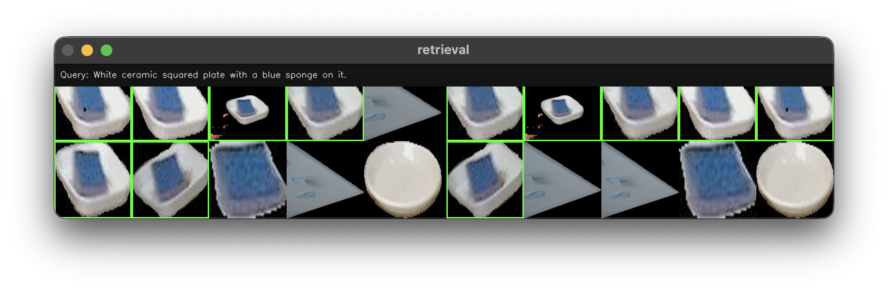
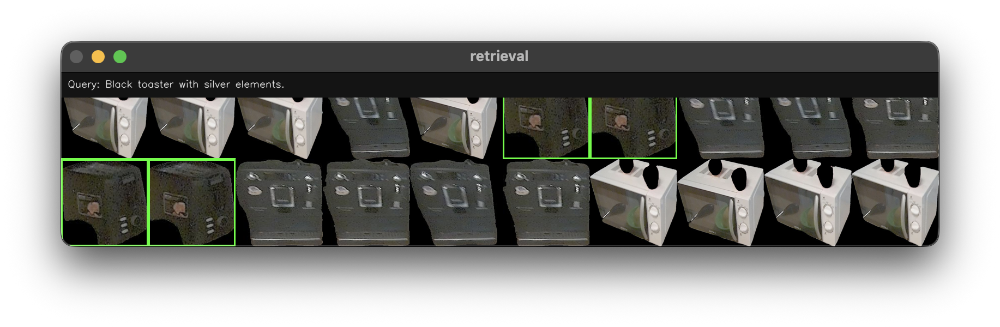
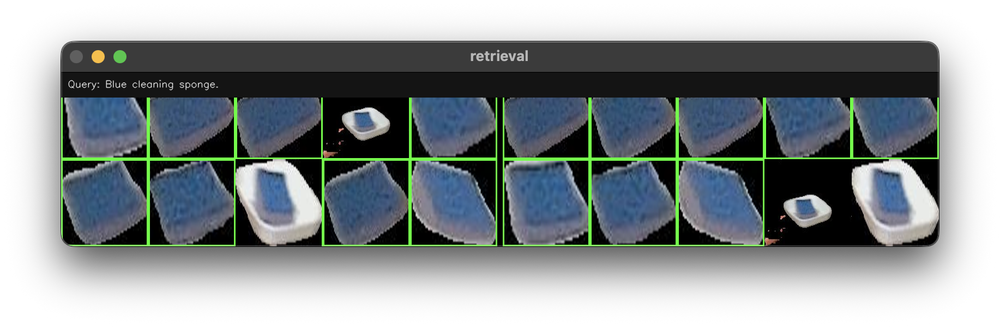
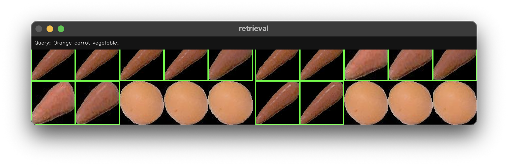

## ROBOKITCHEN: CLIP -> BLIP
### Summary table
| Experiment | R@1 | P@1 | nDCG@1 | R@5 | P@5 | nDCG@5 | R@10 | P@10 | nDCG@10 | MAP@10 |
| --- | --- | --- | --- | --- | --- | --- | --- | --- | --- | --- |
| Baseline CLIP | 0.02 | 0.59 | 0.59 | 0.08 | 0.51 | 0.53 | 0.15 | 0.49 | 0.51 | 0.13 |
| CLIP -> BLIP | 0.02 | 0.71 | 0.71 | 0.09 | 0.58 | 0.61 | 0.15 | 0.49 | 0.54 | 0.14 |
| gemma3:4b(N=4,temp=2) -> CLIP -> BLIP | 0.02 | 0.74 | 0.74 | 0.09 | 0.60 | 0.63 | 0.15 | 0.51 | 0.55 | 0.14 |

### CLIP Text-to-Image metrics (ranx):
```
R@1: 0.02  P@1: 0.59  nDCG@1: 0.59
R@5: 0.08  P@5: 0.51  nDCG@5: 0.53
R@10: 0.15  P@10: 0.49  nDCG@10: 0.51
MAP@10: 0.13
```
### BLIP2-reranked Text-to-Image metrics (ranx):
```
R@1: 0.02  P@1: 0.71  nDCG@1: 0.71
R@5: 0.09  P@5: 0.58  nDCG@5: 0.61
R@10: 0.15  P@10: 0.49  nDCG@10: 0.54
MAP@10: 0.14
```

## ROBOKITCHEN: LLM gemma3:4b Prephrases (N=4,temp=2) -> CLIP -> BLIP

### CLIP Text-to-Image metrics (ranx):
```
R@1: 0.02  P@1: 0.62  nDCG@1: 0.62
R@5: 0.08  P@5: 0.52  nDCG@5: 0.54
R@10: 0.15  P@10: 0.51  nDCG@10: 0.52
MAP@10: 0.13
```

### BLIP2-reranked Text-to-Image metrics (ranx):
```
R@1: 0.02  P@1: 0.74  nDCG@1: 0.74
R@5: 0.09  P@5: 0.60  nDCG@5: 0.63
R@10: 0.15  P@10: 0.51  nDCG@10: 0.55
MAP@10: 0.14
```

## ROBOKITCHEN: LLM gemma3:4b Prephrases (N=6,temp=3) -> CLIP -> BLIP

### CLIP Text-to-Image metrics (ranx):
```
R@1: 0.02  P@1: 0.56  nDCG@1: 0.56
R@5: 0.08  P@5: 0.54  nDCG@5: 0.54
R@10: 0.15  P@10: 0.49  nDCG@10: 0.51
MAP@10: 0.13
```

### BLIP2-reranked Text-to-Image metrics (ranx):
```
R@1: 0.02  P@1: 0.68  nDCG@1: 0.68
R@5: 0.09  P@5: 0.58  nDCG@5: 0.60
R@10: 0.15  P@10: 0.49  nDCG@10: 0.53
MAP@10: 0.14
```

**Avg CLIP query time:** `0.0002s`
**Avg BLIP2 query time:** `1.2384s`

### Left 2x5 - CLIP Right 2x5 - BLIP





