# [CLIP COCO 5K Kharpaty Split dataset]

## Baseline captions

### Baseline CLIP (ViT-L-14, OpenAI pretrain)
```
R@1:  0.36    Map@R: 0.32
R@5:  0.61    R-P: 0.42
R@10: 0.71    ECCV R@1: 0.73

Avg query time: 0.0002s
```


\newpage

### CLIP (ViT-L-14, OpenAI pretrain) -> ALBEF (base)
```
R@1: 0.52   Map@R: 0.41
R@5: 0.76   R-P: 0.50
R@10: 0.84  ECCV R@1: 0.87

Avg query time: 0.9762s
```
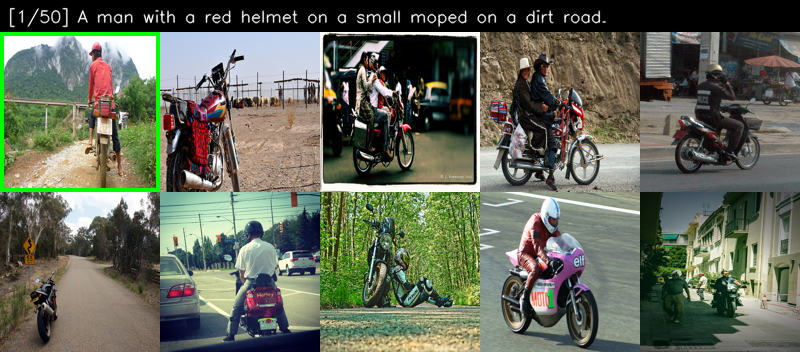


\newpage

### CLIP (ViT-L-14, OpenAI pretrain) -> BLIP2 ITM (pretrain)
```
R@1: 0.63   Map@R: 0.42
R@5: 0.83   R-P: 0.49
R@10: 0.87  ECCV R@1: 0.92

Avg query time: 1.3981s
```


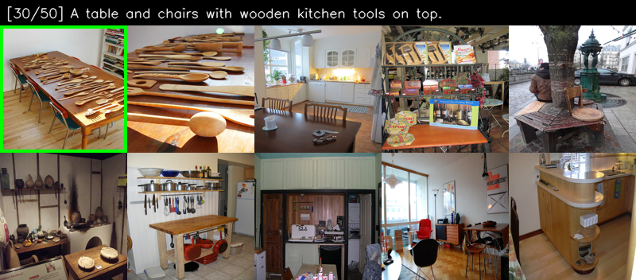

\newpage

### CLIP (ViT-L-14, OpenAI pretrain) -> Qwen3-VL-Embedding (Qwen3-VL-Reranker-2B)
```
R@1: 0.60   Map@R: 0.41
R@5: 0.81   R-P: 0.49
R@10: 0.86  ECCV R@1: 0.89

Avg query time: 2.9850s
```
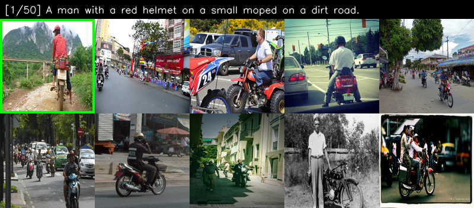

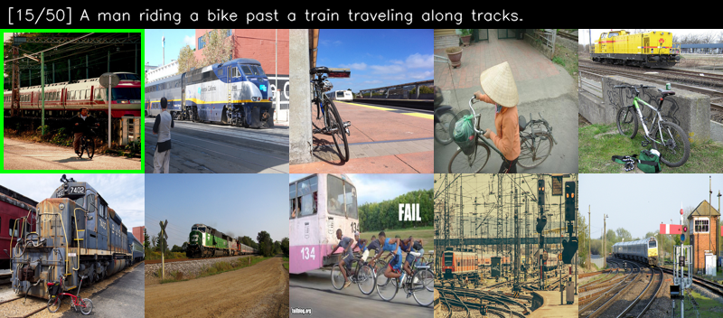

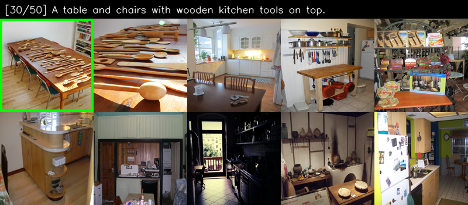

\newpage

### dino.txt (ViT-L-14, pretrained)
```
R@1:  0.47    Map@R: 0.40
R@5:  0.72    R-P:   0.49
R@10: 0.80   ECCV R@1: 0.83

Avg query time: 0.0007s
```


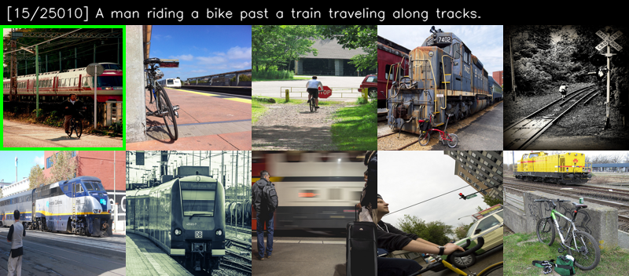


\newpage

# [robotics_kitchen_dataset_v3]

## Baseline captions

### Baseline CLIP (ViT-L-14, OpenAI pretrain)
```
R@1: 0.02  P@1: 0.59  nDCG@1: 0.59
R@5: 0.08  P@5: 0.51  nDCG@5: 0.53
R@50: 0.50  P@50: 0.37  nDCG@50: 0.50
MAP@50: 0.38

Avg query time: 0.0002s
```


\newpage

### CLIP (ViT-L-14, OpenAI pretrain) -> ALBEF (base)
```
R@1: 0.02  P@1: 0.53  nDCG@1: 0.53
R@5: 0.08  P@5: 0.54  nDCG@5: 0.54
R@50: 0.50  P@50: 0.37  nDCG@50: 0.50
MAP@50: 0.39

Avg query time: 0.0901s
```


\newpage

### CLIP (ViT-L-14, OpenAI pretrain) -> BLIP2 ITM (pretrain)
```
R@1: 0.02  P@1: 0.71  nDCG@1: 0.71
R@5: 0.09  P@5: 0.60  nDCG@5: 0.62
R@50: 0.50  P@50: 0.37  nDCG@50: 0.53
MAP@50: 0.42

Avg query time: 0.9285s
```


\newpage

### CLIP (ViT-L-14, OpenAI pretrain) -> Qwen3-VL-Embedding (Qwen3-VL-Reranker-2B)
```
R@1: 0.02  P@1: 0.74  nDCG@1: 0.74
R@5: 0.10  P@5: 0.63  nDCG@5: 0.65
R@50: 0.50  P@50: 0.37  nDCG@50: 0.54
MAP@50: 0.42

Avg query time: 2.0804s
```


\newpage

## LLM (gemma3:4b) enriched captions (N=4, T=2)

### CLIP (ViT-L-14, OpenAI pretrain) -> BLIP2 ITM (pretrain)
```
R@1: 0.02  P@1: 0.65  nDCG@1: 0.65
R@5: 0.10  P@5: 0.62  nDCG@5: 0.63
R@50: 0.51  P@50: 0.37  nDCG@50: 0.54
MAP@50: 0.42

Avg query time: 0.9454s
```


\newpage

### CLIP (ViT-L-14, OpenAI pretrain) -> Qwen3-VL-Embedding (Qwen3-VL-Reranker-2B)
```
R@1: 0.02  P@1: 0.74  nDCG@1: 0.74
R@5: 0.11  P@5: 0.66  nDCG@5: 0.68
R@50: 0.51  P@50: 0.37  nDCG@50: 0.55
MAP@50: 0.42

Avg query time: 2.1155s
```


\newpage

## DINO2 Meets text

### dino.txt (ViT-L-14, pretrained)
```
R@1: 0.03  P@1: 0.74  nDCG@1: 0.74
R@5: 0.15  P@5: 0.72  nDCG@5: 0.74
R@50: 0.67  P@50: 0.44  nDCG@50: 0.67
MAP@50: 0.55

Avg query time: 0.0001s
```
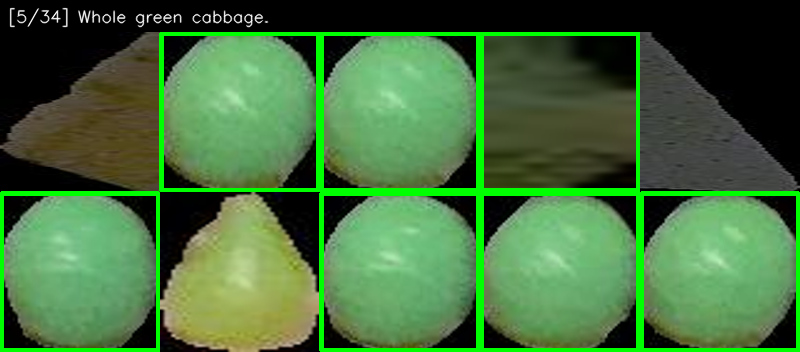

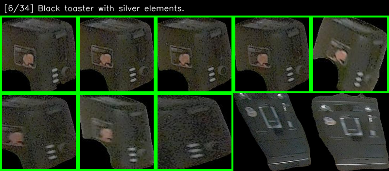

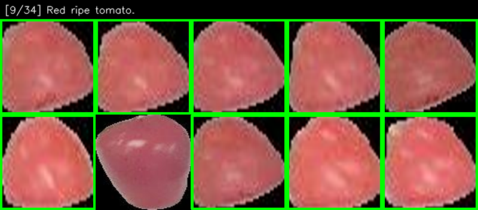

\newpage

## Side Quest: SigLIP and ELIP benchmarks

### CLIP (ViT-L-14, OpenAI pretrain) -> ELIP-B (Official pretrain full_model_iccv_v27-20241229044-checkpoint_0)
```
R@1: 0.02  P@1: 0.71  nDCG@1: 0.71
R@5: 0.11  P@5: 0.66  nDCG@5: 0.67
R@50: 0.51  P@50: 0.37  nDCG@50: 0.55
MAP@50: 0.44

Avg query time: 6.0723s
```


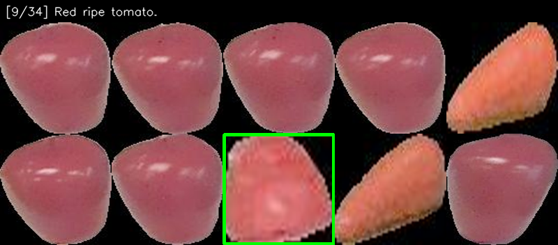

\newpage

### SigLIP (ViT-SO400M-14-SigLIP2-378, webli pretrain) -> ELIP-B (Official pretrain full_model_iccv_v27-20241229044-checkpoint_0)
```
R@1: 0.02  P@1: 0.68  nDCG@1: 0.68
R@5: 0.10  P@5: 0.68  nDCG@5: 0.68
R@50: 0.53  P@50: 0.36  nDCG@50: 0.54
MAP@50: 0.43

Avg query time: 6.1804s
```
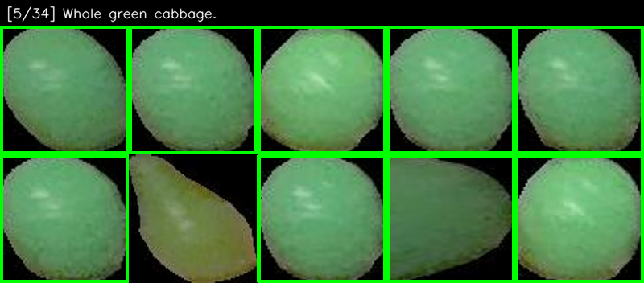


\newpage

---

## Summary Tables

### COCO 5K Karpathy Split — Text-to-Image Retrieval

| Model | R@1 | R@5 | R@10 | MAP@R | R-P | ECCV R@1 | Avg Query Time |
|-------|-----|-----|------|-------|-----|----------|----------------|
| CLIP (baseline) | 0.36 | 0.61 | 0.71 | 0.32 | 0.42 | 0.73 | 0.0002s |
| DinoTxt | 0.47 | 0.72 | 0.80 | 0.40 | 0.49 | 0.83 | 0.0007s |
| CLIP + ALBEF | 0.52 | 0.76 | 0.84 | 0.41 | 0.50 | 0.87 | 0.9762s |
| CLIP + Qwen3-VL | 0.60 | 0.81 | 0.86 | 0.41 | 0.49 | 0.89 | 2.9850s |
| **CLIP + BLIP2 ITM** | **0.63** | **0.83** | **0.87** | **0.42** | **0.49** | **0.92** | **1.3981s** |

### Robotics Kitchen — Baseline Captions

| Model | P@1 | P@5 | nDCG@5 | nDCG@50 | MAP@50 | Avg Query Time |
|-------|-----|-----|--------|---------|--------|----------------|
| CLIP (baseline) | 0.59 | 0.51 | 0.53 | 0.50 | 0.38 | 0.0002s |
| CLIP + ALBEF | 0.53 | 0.54 | 0.54 | 0.50 | 0.39 | 0.0901s |
| CLIP + BLIP2 ITM | 0.71 | 0.60 | 0.62 | 0.53 | 0.42 | 0.9285s |
| CLIP + Qwen3-VL | 0.74 | 0.63 | 0.65 | 0.54 | 0.42 | 2.0804s |
| CLIP + ELIP-B | 0.71 | 0.66 | 0.67 | 0.55 | 0.44 | 6.0723s |
| **DinoTxt** | **0.74** | **0.72** | **0.74** | **0.67** | **0.55** | **0.0001s** |

### Robotics Kitchen — LLM-Enriched Captions (gemma3:4b, N=4, T=2)

| Model | P@1 | P@5 | nDCG@5 | nDCG@50 | MAP@50 | Avg Query Time |
|-------|-----|-----|--------|---------|--------|----------------|
| CLIP + BLIP2 ITM | 0.65 | 0.62 | 0.63 | 0.54 | 0.42 | 0.9454s |
| **CLIP + Qwen3-VL** | **0.74** | **0.66** | **0.68** | **0.55** | **0.42** | **2.1155s** |

### Robotics Kitchen — Alternative First-Stage Retrievers with ELIP-B Reranking

| First-Stage Retriever | P@1 | P@5 | nDCG@5 | nDCG@50 | MAP@50 |
|-----------------------|-----|-----|--------|---------|--------|
| SigLIP + ELIP-B | 0.68 | 0.68 | 0.68 | 0.54 | 0.43 |
| **CLIP + ELIP-B** | **0.71** | **0.66** | **0.67** | **0.55** | **0.44** |

---

## Conclusion

DinoTxt achieves the best quality (MAP@50: 0.55) and fastest inference (0.0001s/query), outperforming all two-stage CLIP + reranker pipelines. Among rerankers, BLIP2 ITM and Qwen3-VL improve P@1 significantly but at 4-5 orders of magnitude higher latency. LLM-enriched captions provide marginal gains.
